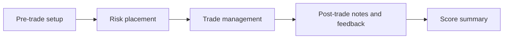

# Trade Compliance Tool — Build Spec v1.0

## Purpose and scope

A hosted web app that walks a trader through every trade as a four stage checklist and returns a weighted compliance score. It lives at its own URL, supports multiple users with their own accounts, and runs on pure deterministic logic with no AI calls.

**In scope for v1**

- Account signup and login, each user sees only their own data
- A user defined ruleset built on four fixed default stages, fully editable checks and weights
- A stepper that logs one trade at a time, stage by stage, in the order the trade actually happens
- Live compliance scoring per stage and in total, visible throughout
- Trade history with scores, and a view of which stages leak the most compliance over time
- Ruleset versioning so old trades stay graded against the rules live when they were taken

**Out of scope for v1**

- Any Claude or LLM API calls
- Chart screenshot uploads and image analysis
- Broker or platform integrations (FX Replay CSV import is a v2 candidate)
- Sharing rulesets between users

## Stack and architecture

Next.js on Vercel for the app and hosting, Supabase for auth and Postgres storage. All free tier at this scale, and every git push redeploys the live link.

| Layer | Choice | Role |
| --- | --- | --- |
| Frontend | Next.js (App Router), TypeScript, Tailwind | Stepper, dashboard, ruleset editor |
| Motion | Framer Motion | Ring fills, stage transitions, completion effects |
| Auth | Supabase Auth (email + password, magic link) | Accounts and sessions |
| Database | Supabase Postgres with row level security | Rulesets, trades, results |
| Scoring | Pure TypeScript module in `lib/scoring` | Deterministic, unit tested, no network |
| Hosting | Vercel | Public URL, preview deploys per branch |

**Core principle: rules are data, not code.** Stages, checks and weights live in the database. The app renders whatever ruleset the user has defined, and the scoring function takes a ruleset plus a set of answers and returns scores. Nothing about a specific trading method is hardcoded.

**Security:** row level security on every table so a user can only read and write rows where `user_id` matches their session. No secrets in the browser beyond the Supabase anon key, which is safe to expose when RLS is on.

## User flow

One trade is logged as a single guided pass through four stages, in the order the trade actually happens. A failed or skipped check flags amber and never blocks progress.



**Default stages (every new user starts with these, then edits the checks beneath)**

1. **Pre-trade setup:** bias, conditions and setup criteria met before entry
2. **Risk placement:** stop loss and take profit at valid levels and arrays, position size within limits, R:R meets minimum
3. **Trade management:** managed the live trade per plan (partials, stop adjustments, no unplanned intervention)
4. **Post-trade notes and feedback:** notes taken on placement and close, plus free text fields for the notes and a self review

**Check states.** Each check has three states: met (green), not met (amber, logged as a breach), and not yet answered (neutral). A stage cannot be marked complete while any check is unanswered, but a stage full of ambers can be completed.

**Layout.** A horizontal stage rail across the top shows all four stages with their own mini ring. The active stage sits in a central panel. A fixed widget in the bottom right corner shows the live total score. Users can click back to any earlier stage to amend it until the trade is submitted.

**On submit** the trade locks, and the summary screen shows per stage scores, total score, and every amber breach listed by stage.

## Scoring model

Every check carries a weight, and scores are weighted sums, not tick counts. A missed foundational check visibly drags the number down.

**Stage score**

```latex
\text{Stage \%} = \frac{\sum \text{weights of met checks}}{\sum \text{weights of all checks in stage}} \times 100
```

**Total score.** Each stage also carries a weight (defaults: pre-trade 30, risk placement 35, trade management 20, post-trade 15, user editable). Total = sum of each stage percentage multiplied by its stage weight, divided by the sum of stage weights.

**Live score while in progress.** The corner widget shows two numbers: secured (met weight over total possible weight) and running (met weight over weight answered so far). Secured starts at 0% and climbs as you tick. Running tells you how clean you have been so far.

**Critical checks.** A check can be flagged critical. If any critical check is amber, the trade is labelled non-compliant regardless of the percentage. This stops a trade scoring 90% while having no stop loss.

**Weight input.** Users set weights 1 to 10 per check. The app normalises within each stage, so users never do arithmetic.

**Worked example.** Risk placement has four checks weighted 10, 8, 5, 2 (total 25). Met: 10 and 5. Stage score = 15 / 25 = 60%.

The scoring function is pure: `score(ruleset, answers) → { stages, total, secured, running, nonCompliant, breaches }`. It must have unit tests covering empty answers, all met, all amber, and critical breach cases.

## Data schema

Six tables plus Supabase's built in `auth.users`. Rulesets are versioned: editing a ruleset that has trades against it creates a new version rather than mutating the old one.

| Table | Key columns | Notes |
| --- | --- | --- |
| `profiles` | `id` (= auth user id), `display_name`, `created_at` | One row per user |
| `rulesets` | `id`, `user_id`, `name`, `version`, `is_active`, `parent_id`, `created_at` | `parent_id` links versions; one active per user |
| `stages` | `id`, `ruleset_id`, `name`, `order`, `weight` | Four defaults seeded on signup |
| `checks` | `id`, `stage_id`, `label`, `description`, `weight` (1 to 10), `is_critical`, `order`, `input_type` | `input_type`: `tick` or `text` (for notes fields) |
| `trades` | `id`, `user_id`, `ruleset_id`, `pair`, `direction`, `opened_at`, `closed_at`, `result_r`, `status` (`draft` / `submitted`), `total_score`, `non_compliant` | Scores stored on submit for fast history queries |
| `check_results` | `id`, `trade_id`, `check_id`, `state` (`met` / `not_met` / `unanswered`), `text_value`, `answered_at` | One row per check per trade |

**Versioning rule.** When a user edits a ruleset that has at least one submitted trade, the app copies it to a new version (`version + 1`, `parent_id` set), applies the edit there, and marks it active. Trades always point to the exact version they were graded under.

**Row level security.** Every table gets a policy restricting select, insert, update and delete to rows owned by `auth.uid()`, directly via `user_id` or through the parent chain (checks → stages → rulesets → user).

**Signup trigger.** A Postgres function on new user creation inserts a profile, an active v1 ruleset, and the four default stages with a starter set of example checks the user can edit or delete.

## Design spec

Dark, restrained, premium: closer to a private bank terminal than a retail trading app. One accent colour, lots of negative space, motion that confirms actions rather than decorates.

**Palette**

| Token | Value | Use |
| --- | --- | --- |
| `--bg` | #0B0C0E | Page background |
| `--surface` | rgba(255,255,255,0.04) with 12px backdrop blur | Frosted panels |
| `--border` | rgba(255,255,255,0.08) | Hairline panel edges |
| `--text` | #E8E6E1 | Primary text, warm off white |
| `--muted` | #8A8780 | Labels, secondary text |
| `--accent` | #C9A96E | Brushed gold: met checks, active stage, rings |
| `--amber` | #D98E3A | Breach flags |
| `--neutral` | #3A3B3F | Unanswered state, empty ring track |

No pure green or red anywhere. Met is gold, breach is amber, which reads as serious without looking like a retail P&L screen.

**Typography.** Headings in a refined serif (Cormorant Garamond or Playfair Display). Body and labels in Inter. All numbers, scores and percentages in a monospace with tabular figures (JetBrains Mono or IBM Plex Mono) so digits do not jump as they animate.

**Signature components**

- **Progress rings:** SVG circles with a thin 3px stroke. Each stage has a small ring on the stage rail, the corner widget has a large one. The arc animates smoothly when a check changes, and the percentage counts up
- **Check toggles:** circular selectors, not square checkboxes. Tapping fills the circle with gold from the centre outwards with a subtle glow. Tapping again cycles to amber, then back to unanswered
- **Stage rail:** four nodes joined by a hairline. The line fills with gold as stages complete
- **Corner score widget:** fixed bottom right, frosted glass, large ring with secured % in the centre and running % beneath in muted text. Pulses once when a stage completes
- **Summary screen:** four stage rings in a row, one hero ring for the total, breaches listed beneath in amber

**Background.** A very faint grid (1px lines at 3% opacity) with a slow radial gradient glow drifting behind the active panel, and optionally a barely visible abstract price line or candlestick silhouette at 2 to 3% opacity. It should be noticed only on a second look.

**Motion.** Framer Motion throughout. Stage transitions slide and fade at 250ms with easing, never bouncy. Respect the user's reduced motion setting.

**Responsive.** Works on phone for logging trades on the go: the stage rail collapses to a compact top bar and the corner widget shrinks to a pill.

## Repo structure and build sequence

Hand this doc to Claude Code as the spec, then build in the phases below. Deploy after phase 1 so the live link exists from day one, and confirm each phase works before starting the next.

```
compliance-tool/
  app/
    (auth)/login/          # sign in, sign up, magic link
    trade/new/             # the stepper
    trade/[id]/            # summary of a submitted trade
    trades/                # history and stage leak analytics
    ruleset/               # stage and check editor
  components/
    ProgressRing.tsx
    CheckToggle.tsx
    StageRail.tsx
    ScoreWidget.tsx
    Background.tsx
  lib/
    scoring/score.ts       # pure scoring function
    scoring/score.test.ts
    supabase/client.ts
    supabase/server.ts
  supabase/
    migrations/            # schema, RLS policies, signup trigger
  styles/tokens.css        # design tokens from the palette table
```

**Build phases**

1. **Scaffold and deploy.** Next.js + Tailwind + TypeScript, push to GitHub, connect Vercel, confirm the live URL loads
2. **Database.** Supabase project, migrations for all six tables, RLS policies, signup trigger with default stages
3. **Auth.** Login and signup pages, protected routes, session handling
4. **Scoring engine.** `score.ts` plus full unit tests, built before any UI touches it
5. **Design system.** Tokens, fonts, ProgressRing, CheckToggle, background, tested in isolation on a scratch page
6. **Stepper.** Stage rail, stage panels, corner widget, draft autosave, submit and lock
7. **Summary and history.** Per trade summary, trade list, average compliance per stage over time
8. **Ruleset editor.** Add, edit, reorder, delete checks and stages, weights and critical flags, versioning on edit
9. **Polish.** Mobile layout, reduced motion, empty states, loading states

**How to prompt Claude Code.** One phase per session. Start each with: "Read SPEC.md (this doc exported as markdown). Implement phase N only. Do not start phase N+1." Review and test before moving on.

## Open decisions

- [ ] Your own checks and weights for each of the four stages (needed to seed your account and test scoring properly)
- [ ] Default stage weights: keep 30 / 35 / 20 / 15 or change
- [ ] Which checks are critical by default (suggested: stop loss placed, position size within limit)
- [ ] Trade fields beyond pair and direction: entry, stop, target, session, model tag?
- [ ] App name and domain (Vercel gives a free subdomain; a custom domain costs roughly £10 a year)
- [ ] Whether post-trade notes are required for the stage to count as complete, or optional text
- [ ] v2 candidates to park: FX Replay CSV import, sharing a ruleset template with other users
